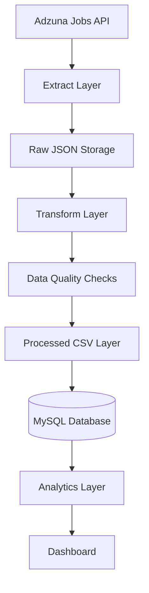

# Job Market Intelligence Platform

An end-to-end Data Engineering and Analytics project that collects software engineering job postings from the Adzuna API, transforms and validates the data, stores it in a relational database, and generates insights about hiring trends, demand hotspots, and skill requirements.

The project is designed to mirror a real-world ETL pipeline used by analytics and data engineering teams.

---

## Project Overview

The goal of this project is to build an automated pipeline that tracks labor market trends by collecting job postings and converting them into actionable insights.

The platform is designed to answer questions such as:

* Which companies are hiring the most software engineers?
* Which cities have the highest demand for technical talent?
* What technologies and skills are most frequently requested?
* How are hiring trends changing over time?
* What proportion of roles are remote versus location-based?
* Which states have the most openings?
* Which companies are hiring in each city? 
* Which companies post the most jobs over time?
* Average jobs posted per day 
* Most recent job postings 
* Data Quality Metrics

This project demonstrates the complete data lifecycle:

* Data Extraction
* Data Transformation
* Data Validation
* Database Loading
* Analytics Engineering
* Dashboard Development
* Workflow Automation

---

## Architecture



---

## Current Pipeline Status

### Completed
* API Integration
* Raw Data Storage
* Data Transformation
* Data Quality Checks
* MySQL Database Design
* Database Loading Layer
* Analytics Layer

### In Progress
* Dashboard Development

### Planned
* Pipeline Scheduling
* Trend Analysis
* Cloud Storage

---

## Tech Stack

* Programming : Python 3.11+
* Data Processing: Pandas
* API Integration: Requests
* Database: MySQL 8, SQLAlchemy
* Configuration: python-dotenv
* Dashboard : Streamlit, Plotly
* Testing (Planned): Pytest
* Version Control: Git, GitHub

---

## Project Structure

```text
job-market-intelligence/

├── data/
│   ├── raw/
│   └── processed/
│
├── logs/
│   └── pipeline.log
│
├── sql/
│   └── analytics/
│       └── analytics.py
│
├── src/
│   ├── config/
│   │   └── settings.py
│   │
│   ├── dashboard/
│   │   ├── app.py
│   │   ├── data_loader.py
│   │   └── queries.py
│   │
│   ├── extract/
│   │   ├── db.py
│   │   └── load_jobs.py
│   │
│   ├── extract/
│   │   ├── adzuna.py
│   │   ├── save_raw.py
│   │   └── explore.py
│   │
│   ├── quality/
│   │   └── checks.py
│   │
│   ├── transform/
│   │   ├── clean_jobs.py
│   │   └── save_processed.py
│   │
│   └── __init__.py
│  
├── tests/
│  
├── .env
├── .env.example
├── .gitignore
├── test_analytics.py
├── test_db.py
├── main.py
├── requirements.txt
└── README.md
```

---

## Data Pipeline

### 1. Extract

The pipeline retrieves software engineering job postings from the Adzuna API.

Example source fields:

* Job ID
* Title
* Company
* Location
* Description
* Created Date

Raw API responses are stored as timestamped JSON snapshots.

Example:

```text
data/raw/jobs_20260623_183940.json
```

---

### 2. Transform

The transformation layer:

* Flattens nested JSON structures
* Standardizes field names
* Parses location information into:
  * city
  * state
  * country
* Converts timestamps into UTC datetime format
* Produces an analytics-ready dataset

Output:

```text
data/processed/jobs_clean_YYYYMMDD_HHMMSS.csv
```

---

### 3. Data Quality Validation

Before loading, the pipeline validates:

* Total row count
* Duplicate job IDs
* Missing titles
* Missing companies
* Missing cities
* Missing states

Example output:

```text
--- Data Quality Report ---

total_rows: 50
duplicate_job_ids: 0
missing_titles: 0
missing_companies: 0
missing_cities: 18
missing_states: 18
```

---

### 4. Load (In Progress)

The cleaned dataset will be loaded into MySQL for analytics and reporting.

---

## Data Model

### jobs

| Column        | Type         | Description                       |
| ------------- | ------------ | --------------------------------- |
| source_job_id | VARCHAR(50)  | Unique job identifier from Adzuna |
| title         | VARCHAR(255) | Job title                         |
| company       | VARCHAR(255) | Hiring company                    |
| city          | VARCHAR(100) | Job city                          |
| state         | VARCHAR(100) | Job state                         |
| country       | VARCHAR(100) | Job country                       |
| created_at    | DATETIME     | Original job posting timestamp    |
| description   | TEXT         | Job description                   |
| inserted_at   | TIMESTAMP    | Database insertion timestamp      |

---

## Environment Variables

Create a `.env` file in the project root or refer [`.env.example`](.env.example):

```env
ADZUNA_APP_ID=your_app_id
ADZUNA_APP_KEY=your_app_key

MYSQL_HOST=localhost
MYSQL_PORT=3306
MYSQL_DATABASE=job_market_intelligence
MYSQL_USER=root
MYSQL_PASSWORD=your_password
```

Do not commit this file to GitHub.

---

## Installation

Clone the repository:

```bash
git clone https://github.com/Pranav-MSK/job-market-intelligence.git

cd job-market-intelligence
```

Create a virtual environment:

```bash
python -m venv venv
```

Activate the environment.

### Windows

```bash
venv\Scripts\activate
```

### Linux / macOS

```bash
source venv/bin/activate
```

Install dependencies:

```bash
pip install -r requirements.txt
```

---

## Running the Pipeline

Execute the ETL pipeline:

```bash
python main.py
```

Example output:

```text
Saved raw file: data/raw/jobs_20260623_183940.json

Rows processed: 50

Columns:
source_job_id
title
company
city
state
country
created_at
description

--- Data Quality Report ---
total_rows: 50
duplicate_job_ids: 0
missing_titles: 0
missing_companies: 0
missing_cities: 18
missing_states: 18

Processed file saved:
data/processed/jobs_clean_20260623_183940.csv
```

---

## Roadmap

### Phase 1 — Data Ingestion

* [x] Project setup
* [x] GitHub repository setup
* [x] Adzuna API integration
* [x] Raw JSON storage

### Phase 2 — Data Processing

* [x] Transformation layer
* [x] Processed CSV generation
* [x] Data quality framework

### Phase 3 — Data Storage

* [x] MySQL database design
* [ ] Database loading layer
* [ ] Incremental loading
* [ ] Duplicate-safe inserts

### Phase 4 — Analytics

* [ ] SQL analytics queries
* [ ] KPI generation
* [ ] Hiring trend analysis
* [ ] Skill demand analysis

### Phase 5 — Visualization

* [ ] Streamlit dashboard
* [ ] Interactive charts
* [ ] Hiring trend monitoring

### Phase 6 — Automation

* [ ] Scheduled pipeline execution
* [ ] Automated refreshes
* [ ] Monitoring and alerts

---

## Why This Project?

This project simulates a real-world data engineering workflow by implementing the complete data lifecycle:

1. Data ingestion from an external API
2. Raw data storage for reproducibility
3. Data transformation and standardization
4. Data quality validation
5. Relational database design
6. Analytics and reporting
7. Workflow automation

The objective is to demonstrate practical skills in:

* Data Engineering
* ETL Development
* API Integration
* Data Modeling
* SQL
* Analytics Engineering
* Dashboard Development
* Workflow Automation

---

<<<<<<< HEAD
=======
## Project Status

Current Phase:

```text
Phase 1: Data Extraction
```

Roadmap:
```
[x] Project Setup
[x] API Integration
[x] Raw Data Storage
[x] Data Transformation
[ ] Database Loading
[ ] Data Quality Framework
[ ] Automation
[ ] Dashboard Development
```

---

>>>>>>> c46aa9271ce3a8f8d0cfb4a3ca77489990520bad
## License

This project is intended for educational and portfolio purposes.
