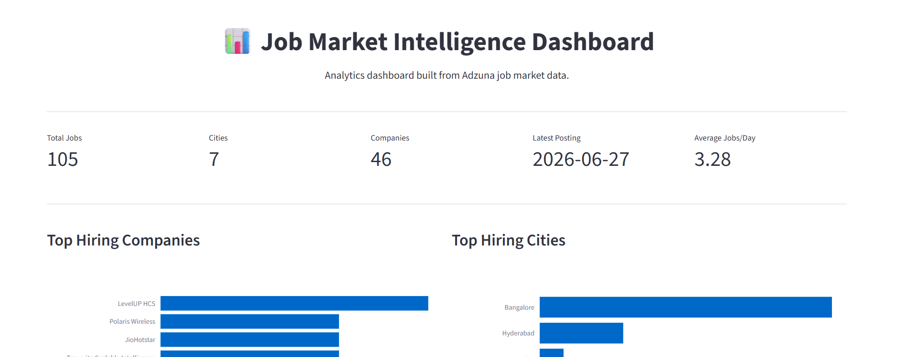
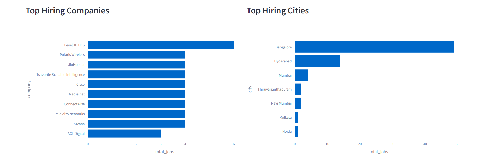
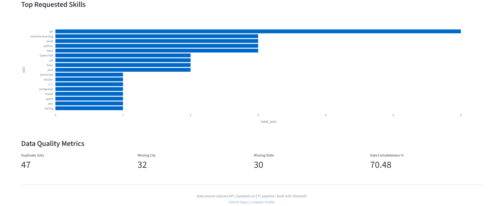
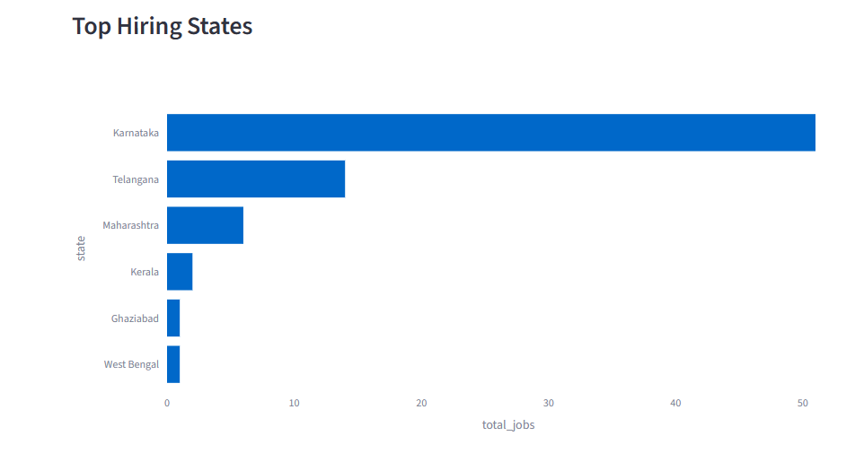
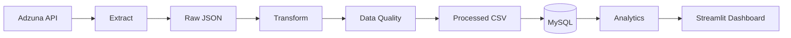

# 📊 Job Market Intelligence Platform

[](LICENSE)
[](https://www.python.org/)
[](https://streamlit.io/)
[](https://www.mysql.com/)

An end-to-end Data Engineering project that collects software engineering job postings from the Adzuna API, transforms and validates the data, stores it in MySQL, and visualizes hiring trends through an interactive Streamlit dashboard.

The project is designed to simulate a production-style ETL pipeline while demonstrating practical data engineering, analytics, and dashboard development skills.

---

## 🚀 Live Demo

Explore the live, interactive data insights here:

👉 **Streamlit Dashboard:** [Job Market Intelligence](https://software-job-market.streamlit.app/) <!--(Update this link after deployment)-->

---

## 🛠️ Skills Demonstrated

* **Data Engineering & ETL:** Designed and built a modular end-to-end batch processing pipeline featuring automated API data ingestion, data transformation, robust quality validation, and duplicate-safe incremental loading.
* **Python Development:** Implemented a clean, object-oriented project structure using `Pandas` for data manipulation, `Requests` for REST API integration, `SQLAlchemy` for ORM connectivity, and `python-dotenv` for environment configuration.
* **SQL & Database Design:** Designed relational MySQL schemas and implemented data modeling best practices, complex aggregate queries, filtering, and optimized data storage logic.
* **Analytics Engineering:** Programmatically extracted technical skills from unstructured job descriptions and developed core business metrics, tracking hiring trends, geographic talent demand, and company-specific KPIs.
* **Data Visualization:** Built interactive, production-ready frontend dashboards using `Streamlit` and `Plotly` complete with dynamic charts, KPI cards, filterable tables, and a split CSV/SQL mode for cloud-optimized deployments.
* **Software Engineering Practices:** Applied industry-standard version control (`Git` & `GitHub`), structured documentation, modular software architecture, dependency management, and virtual environments.

---

## Features

- Automated extraction of software engineering jobs from the Adzuna API
- Raw JSON snapshot storage
- Data cleaning and transformation using Pandas
- Data quality validation
- Incremental loading into MySQL (duplicate-safe)
- Skill extraction from job descriptions
- Interactive Streamlit dashboard
- CSV-based dashboard mode for cloud deployment
- Modular project structure

---
## 📸 Dashboard Preview

| Executive Overview & KPIs | Trend & Company Analytics |
|:---:|:---:|
|  |  |
|  |  |

---

## Key Business Questions

The dashboard is designed to answer questions such as:

- Which companies are hiring the most software engineers?
- Which cities have the highest demand for technical talent?
- Which states have the most job openings?
- Which companies are hiring in each city?
- What technologies and skills are most frequently requested?
- How are hiring trends changing over time?
- Which companies post the most jobs over time?
- What is the average number of jobs posted per day?
- What are the most recent job postings?
- What data quality issues exist in the collected dataset?

---

## Dashboard

The Streamlit dashboard includes:

- KPI cards
- Top hiring companies
- Top hiring cities
- Top hiring states
- Top Requested Skills
- Jobs posted over time
- Company hiring trends
- Recent job postings
- Data quality metrics

---

## Architecture



---

## Tech Stack

| Category | Technology |
|-----------|------------|
| Language | Python 3.11 |
| Data Processing | Pandas |
| API | Adzuna Jobs API |
| Database | MySQL 8 |
| ORM | SQLAlchemy |
| Dashboard | Streamlit |
| Visualization | Plotly |
| Configuration | python-dotenv |
| Version Control | Git & GitHub |

---

## Project Structure

```text
job-market-intelligence/
│
├── data/
│   ├── raw/
│   └── processed/
│
├── docs/
│   ├── ARCHITECTURE.md
│   ├── DASHBOARD.md
│   ├── DATA_PIPELINE.md
│   └── SETUP.md
│
├── logs/
│   └── pipeline.log
│
├── src/
│   │
│   ├── config/
│   │   └── settings.py
│   │
│   ├── dashboard/
│   │   ├── app.py
│   │   ├── data_loader_csv.py
│   │   ├── data_loader_sql.py  
│   │   └── queries.py
│   │ 
│   ├── extract/
│   │   ├── adzuna.py
│   │   └── save_raw.py
│   │
│   ├── load/
│   │   ├── db.py
│   │   ├── load_jobs.py
│   │   └── load_skills.py
│   │
│   ├── quality/
│   │   └── checks.py
│   │
│   ├── transform/
│   │   ├── clean_jobs.py 
│   │   ├── extract_skills.py 
│   │   └── save_processed.py
│   │
│   └── __init__.py
│
├── tests/
│   └── test_db.py
│
├── .env
├── .env.example
├── main.py
├── requirements.txt
├── README.md
└── LICENSE
```
---

## Quick Start

Clone the repository

```bash
git clone https://github.com/Pranav-MSK/job-market-intelligence.git

cd job-market-intelligence
```

Create a virtual environment

```bash
python -m venv venv
```

Activate it

Windows

```bash
venv\Scripts\activate
```

Linux / macOS

```bash
source venv/bin/activate
```

Install dependencies

```bash
pip install -r requirements.txt
```

Create a `.env` file using `.env.example`.

Run the ETL pipeline

```bash
python main.py
```

Launch the dashboard

```bash
python -m streamlit run src/dashboard/app.py
```

---

## Documentation

Detailed documentation is available in the `docs/` directory.

| Document | Description |
|----------|-------------|
| `SETUP.md` | Local installation and configuration |
| `ARCHITECTURE.md` | Project architecture and design decisions |
| `DATA_PIPELINE.md` | ETL pipeline explanation |
| `DASHBOARD.md` | Dashboard features and visualizations |

---

## License

This project is licensed under the MIT License.

See the `LICENSE` file for details.
