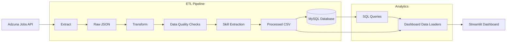

# Architecture

This document describes the architecture of the **Job Market Intelligence Platform**, outlining how data flows through the system from extraction to visualization.

---

# High-Level Architecture



---

# Pipeline Overview

The project follows a modular ETL architecture where each stage has a single responsibility.

| Layer | Purpose |
|--------|---------|
| Extract | Fetch job postings from the Adzuna API |
| Raw Storage | Store original API responses for reproducibility |
| Transform | Clean and normalize the dataset |
| Quality | Validate data before loading |
| Skills | Extract technical skills from job descriptions |
| Load | Store data in MySQL and processed CSV files |
| Analytics | Generate business insights |
| Dashboard | Display metrics and visualizations |

---

# Project Structure

```text
job-market-intelligence/
│
├── data/
│   ├── raw/
│   └── processed/
│
├── docs/
│   ├── ARCHITECTURE.md
│   ├── DASHBOARD.md
│   ├── DATA_PIPELINE.md
│   └── SETUP.md
│
├── logs/
│   └── pipeline.log
│
├── src/
│   │
│   ├── config/
│   │   └── settings.py
│   │
│   ├── dashboard/
│   │   ├── app.py
│   │   ├── data_loader_csv.py
│   │   ├── data_loader_sql.py  
│   │   └── queries.py
│   │ 
│   ├── extract/
│   │   ├── adzuna.py
│   │   └── save_raw.py
│   │
│   ├── load/
│   │   ├── db.py
│   │   ├── load_jobs.py
│   │   └── load_skills.py
│   │
│   ├── quality/
│   │   └── checks.py
│   │
│   ├── transform/
│   │   ├── clean_jobs.py 
│   │   ├── extract_skills.py 
│   │   └── save_processed.py
│   │
│   └── __init__.py
│
├── tests/
│   └── test_db.py
│
├── .env
├── .env.example
├── main.py
├── requirements.txt
├── README.md
└── LICENSE
```

---

# ETL Pipeline

## 1. Extract

The pipeline connects to the Adzuna Jobs API and retrieves software engineering job postings.

Output:

```
Raw API response
```

↓

Saved as timestamped JSON.

Example:

```
data/raw/jobs_20260626_194600.json
```

---

## 2. Transform

The raw JSON is flattened into a structured tabular dataset.

Transformations include:

- Flatten nested JSON
- Standardize column names
- Parse location into:
  - city
  - state
  - country
- Convert timestamps to UTC datetime
- Remove unnecessary nested fields

Output:

```
Pandas DataFrame
```

---

## 3. Data Quality Validation

Before loading, the pipeline validates:

- Total rows
- Duplicate Job IDs
- Missing titles
- Missing companies
- Missing cities
- Missing states

This helps ensure only high-quality data reaches the analytics layer.

---

## 4. Skill Extraction

Each job description is scanned for predefined technical skills.

Example:

```
Python
SQL
Docker
AWS
React
Git
Pandas
FastAPI
```

The extracted frequencies are stored separately.

Output:

```
skills.csv
```

or

```
skills table
```

depending on the selected backend.

---

## 5. Load

The cleaned dataset is written to two destinations.

### MySQL (Development)

- Supports SQL queries
- Incremental loading
- Duplicate-safe inserts
- Skills table

### CSV (Deployment)

The dashboard can run entirely from CSV files.

Files:

```
jobs_latest.csv
skills_latest.csv
```

This removes the requirement for a live database when deploying the Streamlit application.

---

# Dashboard Architecture

```
          Streamlit

               │

       USE_SQL flag

      ┌────────┴────────┐

 MySQL Loader      CSV Loader

      │                  │

   MySQL DB        Latest CSV Files
```

Changing one line in `app.py` switches the dashboard backend.

```python
USE_SQL = True
```

or

```python
USE_SQL = False
```

No dashboard code needs to change.

---

# Database Design

## jobs

| Column | Description |
|---------|-------------|
| source_job_id | Original job identifier |
| title | Job title |
| company | Hiring company |
| city | City |
| state | State |
| country | Country |
| created_at | Posting date |
| description | Full job description |

---

## skills

| Column | Description |
|---------|-------------|
| skill | Technology name |
| total_jobs | Number of postings mentioning the skill |

---

# Dashboard Metrics

The dashboard currently provides:

- Total Jobs
- Companies
- Cities
- Latest Posting Date
- Average Jobs per Day
- Top Hiring Companies
- Top Hiring Cities
- Top Hiring States
- Companies Hiring by City
- Jobs Posted Over Time
- Most Recent Job Postings
- Top Technical Skills
- Data Quality Metrics

---

# Design Principles

The project was intentionally built with a modular architecture.

Each layer is independent:

- Extraction only fetches data.
- Transformation only cleans data.
- Quality only validates data.
- Loading only stores data.
- Dashboard only reads data.

This separation makes the pipeline easier to maintain, test, and extend.

---

# Future Enhancements

Possible future improvements include:

- GitHub Actions for scheduled data collection
- Remote vs. On-site job classification
- Weekly and monthly hiring trends
- Skill trend analysis over time
- Interactive dashboard filters
- Cloud database integration
- Docker containerization
- Automated testing